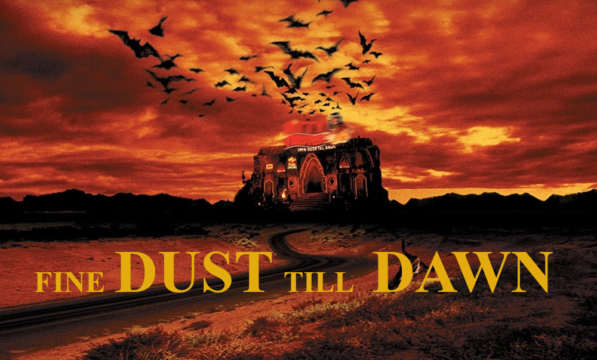

# Kick-off - Fine dust till dawn
$4^{\textrm{th}}$ March 2022
---

---
##  __General Organization of Capstone Phase__ 

* weekly change of project manager (protocol if desired)
* daily start at 9 a.m. with Kanban board
* daily bootcamp group meeting at 2 p.m.
* tools we wanna use:
    | subject | tool | use? |
    |---|---|---|
    | machine learning documentation | MLflow | yes |
    | project management | trello, clickup, GitHub | yes, GitHub
    | dashboard | streamlit, ... | yes|

---
##  __Personal Focus__ 

As the Capstone Phase should still be a time of learning we asked ourselves what we are already good in and what we want to learn. As far as possible we want to take this into account during the weeks to come.

| subject | who's practiced? | who want's to learn (more) |
|---|---|---|
time series | | Filip, Johannes, Kirsten, Nicole |
pipelines | | Filip, Johannes, Kirsten, Nicole |
generic coding (DRY) | Johannes | Filip, Kirsten, Nicole |
data acquisition / SQL | Nicole | Kirsten |
code comment |  | Johannes | |
presentation design | Johannes, Kirsten, Nicole | Filip |
writing texts | Kirsten | | 
project management | Kirsten | | 

---
##  __Story telling__ 

### __Story__
We were hired by some officials, maybe by Deutscher Städte- und Gemeindebund, to predict the particulate matter (PM) pollution in terms of PM2.5 and PM10 for the next day. The people in power aim to inform the citizens about the preventive measures that are going to be taken the next day. Depending on the predicted PM pollution this cold be time-limited bicycle paths on roads, exclusive bus lanes, prohibition of cars with a certain pollutant category or even reduction of industrial pollutant emission.  
The resulting reduction of car lanes sounds counterproductive at first glance as it could result in traffic jams. But if the citizens are properly informed the day before, they can decide to take the bike or at least public transportation. 
Due to the severeness of possible measures the people in power need a trustworthy prediction for next day's morning, noon and evening at the evening of each day.  The PM prediction needs to be done per city during the whole year. To give an impression of our capabilities our stakeholder ordered the prediction of PM pollution for two cities in Germany. One with high and one with relatively small pollution values.

### __Data__
For this project we use open source data provided by [Sensor Community](https://sensor.community/en/) and [Deutscher Wetterdienst](https://opendata.dwd.de/climate_environment/CDC/observations_germany/). We focus on the following cities:
| city | mean PM pollution of today | # monitoring stations | time span | data size |
|---|---|---|---|---|
| Bremen | homogeneous, small | 42 | ... | ... Mb |
|Frankfurt | inhomogeneous, high | ... | ... | ... Mb|

This results in a data size of ... Gb that are still manageable.

### __Objective__
Prediction of PM2.5 and PM10 for next day's morning, noon and evening at the evening of each day.

### __Evaluation Metric__
The quality of our prediction will be measured via root mean squared error (RMSE), because of its interpretability in terms of unity.
